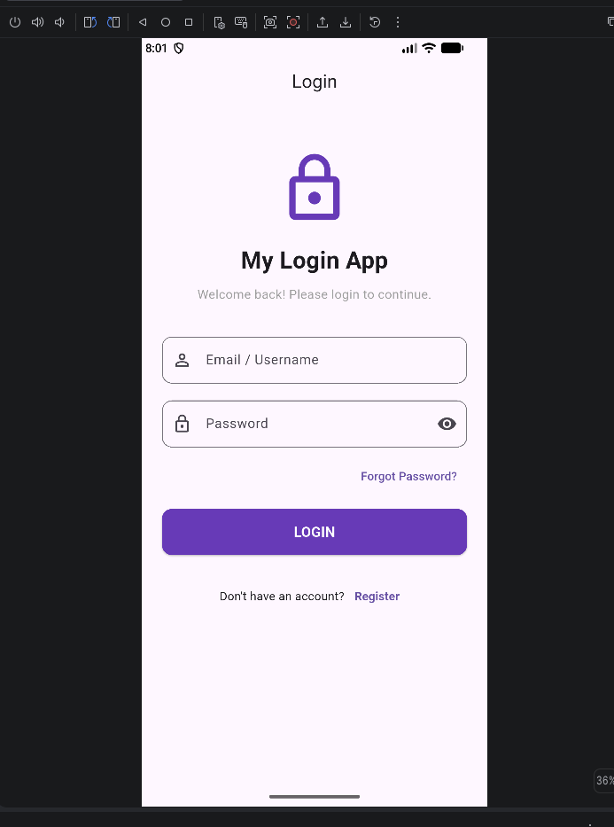
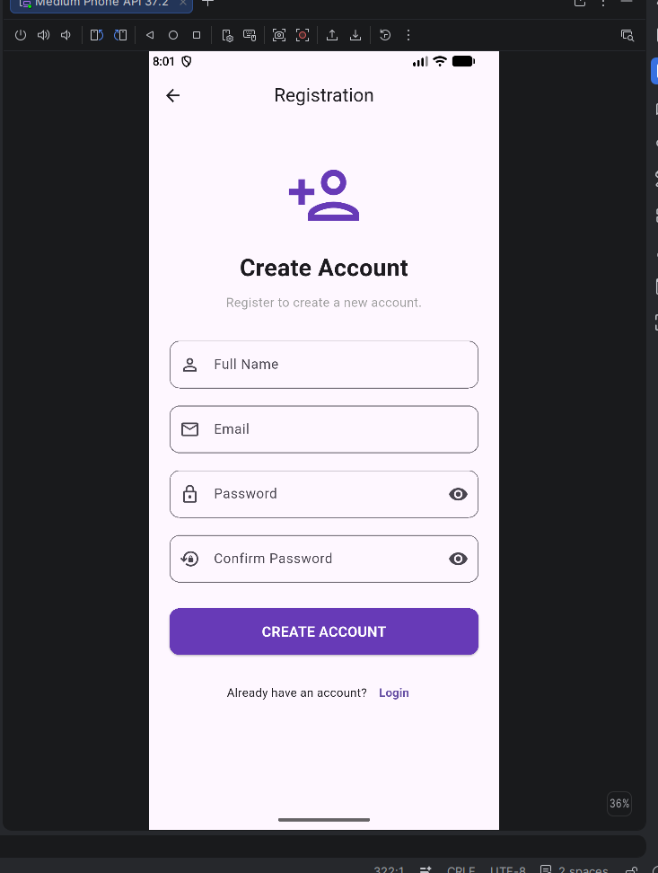

# Flutter Login & Registration App

A simple and modern Login and Registration mobile application developed using Flutter and Dart.

This project was created as part of a Flutter assignment to demonstrate the use of Flutter widgets, layouts, text fields, buttons, navigation, password visibility, and basic form validation.

---

## 📱 Project Overview

The application provides two main screens:

- Login Page
- Registration Page

Users can enter their login details, create a new account, navigate between the Login and Registration pages, and receive basic form validation messages.

---

## ✨ Features

### 🔐 Login Page

- Application logo and name
- Email / Username input field
- Password input field
- Show / Hide password functionality
- Login button
- Forgot Password option
- Navigation to Registration Page
- Basic form validation

### 📝 Registration Page

- Application logo and name
- Full Name input field
- Email input field
- Password input field
- Confirm Password input field
- Show / Hide password functionality
- Create Account button
- Navigation back to Login Page
- Basic form validation
- Password confirmation validation

---

## 🖼️ Screenshots

### Login Page



### Registration Page



---

## 🛠️ Technologies Used

- **Flutter**
- **Dart**
- **Material Design**
- **Android Studio**
- **Git**
- **GitHub**

---

## 📚 Flutter Concepts Used

This project demonstrates several Flutter concepts, including:

- `MaterialApp`
- `Scaffold`
- `StatelessWidget`
- `StatefulWidget`
- `TextFormField`
- `TextEditingController`
- `Form`
- Form validation
- `Column`
- `Row`
- `Padding`
- `SingleChildScrollView`
- `ElevatedButton`
- `TextButton`
- `IconButton`
- `SnackBar`
- `Navigator`
- `MaterialPageRoute`
- Password visibility using `obscureText`

---

## 📂 Project Structure

```text
flutter-login-registration/
│
├── android/
├── ios/
├── linux/
├── macos/
├── web/
├── windows/
│
├── lib/
│   ├── main.dart
│   ├── login_page.dart
│   └── registration_page.dart
│
├── screenshots/
│   ├── login.png
│   └── registration.png
│
├── test/
│
├── pubspec.yaml
├── README.md
└── .gitignore
